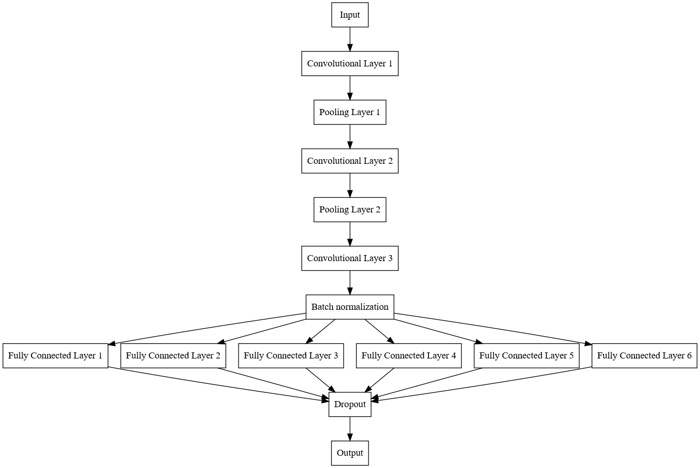

# CAPTCHA Recognition

## CAPTCHA recognition using a CNN
### Introduction

This project aims to develop a machine learning model to recognize CAPTCHA images. CAPTCHAs (Completely Automated Public Turing test to tell Computers and Humans Apart) are used to ensure that a user is human and not a computer. However, they can be difficult for humans to read or may also be vulnerable to attacks. The goal of this project is to develop a model that can recognize CAPTCHA images with good accuracy.
Data

The data used in this project consists of a set of CAPTCHA images and their respective labels. The images are in PNG format and have a resolution of 180x50 pixels. Each image contains 6 characters, and the labels are the corresponding characters in the image. The dataset was split into 80% for training and 20% for testing.

Data: Download Link
### Model

The model architecture consists of several layers, including convolutional layers for feature extraction, pooling layers for down-sampling, and fully connected layers for classification. The input layer receives the CAPTCHA images, and the output layer produces the predicted characters.

-  Input Layer

Receives the raw image or data input.

-  Feature Extraction Layers

Convolutional Layer 1: Applies filters to extract low-level features.
Pooling Layer 1: Reduces spatial dimensions, typically using max pooling.
Convolutional Layer 2: Extracts more complex features.
Pooling Layer 2: Further reduces dimensions.
Convolutional Layer 3: Captures even higher-level features.
Batch Normalization: Normalizes activations to stabilize and accelerate training.

- Classification Layers

The network branches into six fully connected (dense) layers, one for each character in the CAPTCHA.

4. Dropout Layer

Helps prevent overfitting by randomly deactivating neurons during training.

5. Output Layer

Produces the final prediction.

### Training

The model is trained using the Adam optimizer with the loss function "Categorical Crossentropy" and a batch size of 50. Training is conducted over 21 epochs.
### Conclusion

This project demonstrates the effectiveness of using a CNN to recognize CAPTCHA images. The model achieved good accuracy and can potentially be used in real-world applications. Details about the results can be found in the body of the notebook itself.